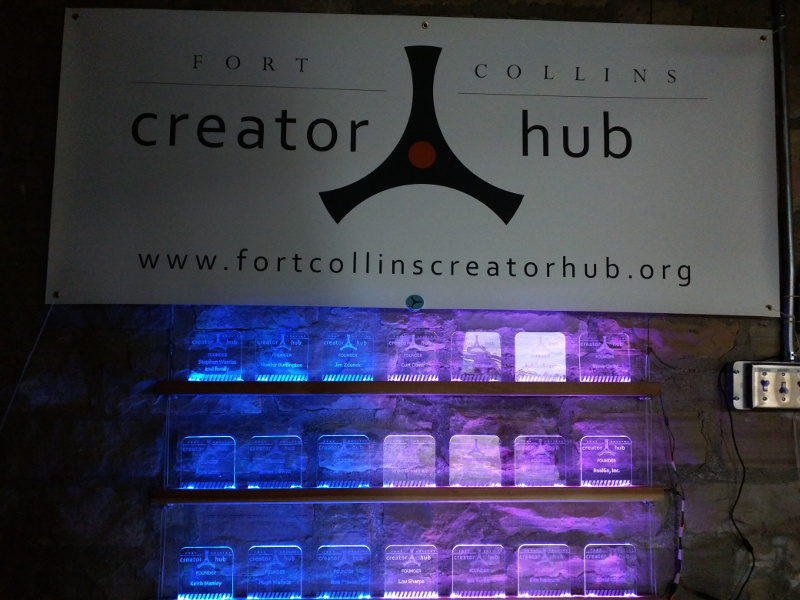

# Introduction

In order to honor [FCCH](http://fortcollinscreatorhub.org/)'s Founders, I
decided to make an LED-lit plaque installation. This now hangs at the bottom
of the stairs in our space's entry-way.

The basic elements of the display are:

- LASER-engraved/cut acrylic plaques.
- Wooden beams with channels cut to hold the plaques, and the LEDs to light
them.
- Hardware to hang the beams.
- An ESP8266 that drives the LEDs.

# Plaques

The plaques are both engraved and then cut out using FCCH's "K40" LASER
engraver/cutter.

The design was created in Inkscape running on Linux. I didn't actually put a
lot of thought into it; when I first had the idea for the display I quickly
knocked something together, and figured that the diagonal stripes at the
bottom reminded me of an "under construction" sign, which was very
appropriate since Founders were funding our "construction", and as a space
we should always be constructing things. Once we got our LASER
engraver/cutter and actually started building the project, I just kept using
the same plaque image, so it's now immortalized!

In order to load the design into the LASER cutter software (CorelDraw 12
under Windows, unfortunately), I used Inkscape on Windows to load the
original Inkscape SVG design, edit the text to contain the appropriate
Founder's name, and export to EMF format. Either Inkscape is bad at file
export, or CorelDraw is bad at file import, or both! You need luck for the
export/import process to work well. I tried many different formats including
HPGL, DXF, WMF, EMF, and more. EMF seemed to work where other formats didn't.

I sourced the acrylic material from
[Fort Collins Plastics](http://www.fortcollinsplastics.com/). They sell a
variety of scrap plastic off-cuts for cheap prices. I managed to get about 8
square feet (in 3 or 4 pieces) of 1/8" clear colorless acrylic for about
$15.

I obtained a couple of different materials. One had a paper-based protective
sheet, which vaporized very well during the engraving process and resulted
in clean plaques. The other material had a brown plastic protective sheet,
which didn't always vaporize as well, and often left residue behind which
had to be manually removed. Many thanks to my wife for helping out here!
I know which material I'd buy again if given the choice:-) 

I used FCCH's band-saw to cut the acrylic into a roughly 12" x 6" strips.
These fit nicely into our LASER cutter/engraver, and yield two plaques
with minimal waste.

In order to actually engrave and cut the plaques, I did the following:

- Loaded/imported the relevant EMF file into CorelDraw.
- The import process doesn't maintain the object size that I had set in
Inkscape. So, I selected everything, and resized it to 5.3" width and
height using the dimension text boxes in the toolbar. I don't recall exactly
why I picked this size; I expect it fit well into the first piece of scrap
I tried. Since the diagonal lines at the bottom of the plaque extend beyond
the width of the outline, whereas nothing extends above or below the
outline, this causes a slightly non-square image. However, the difference is
minimal so it's extremely hard to tell. I also moved all the objects roughly
to the top-left of the page, although I don't think this was strictly
necessary. This did make the next step easier though.
- In the top-left of the design, there is a very tiny rectangle outside the
main plaque outline. I moved this slightly to the left, so that it was the
left-most object. I should have done this in Inkscape, but I forgot the
diagonal lines at the bottom of the image extended to the left of the plaque
outline. I put this object there so that there would always be something at
the very top-left of the image. Otherwise, when objects are deleted to
separate out the engraving/cutting steps (see below), the LASER software
resets the origin to the top-left most object, and that varies when
different objects are present, and this causes the engraving and cutting
steps not to line up. My own plaque doesn't quite line up for this reason.
- I deleted a couple of objects that I accidentally left in the Inkscape
design; you can see them highlighted in red
[here](plaques/hidden-rectangle.png). I think I left these in while fiddling
about with fill/stroke styles while creating the diagonal lines. If these
aren't deleted, then the LASER software engraves/cuts the corners of those
objects even though you can't see them, and this results in a nasty dot
appearing on the plaque. I forgot to do this step on some plaques; perhaps
now everything is complete I'll go back and redo those. Some could do with
cleaning up to remove some of that brown plastic residue too! I've now gone
back and cleaned up the SVG file to remove these objects. The updated file
is included in this repository. I have not re-exported all the EMF files
though.
- I performed the engraving step first. To do this I deleted the rounded
rectangle that forms the plaque outline, and engraved everything else.
Deleting the outline enabled quicker engraving, since the LASER head didn't
have to move the full width of the plaque on every line, but rather could
scan back and forth quickly in areas where the logo or text was narrow.
IIRC, I engraved at 300-450mm/s and somewhere between 10-14mA. I think some
plaques were made using different parameters, as I tried to find the fastest
setting that yielded good results. After engraving was finished, I performed
an "undo" to restore the outline rectangle.
- Once the engraving was complete, I cut out the plaque's outline. To do
this, I deleted everything except the outline and the little dot in the
top-left, and performed a cut operation. I found that if I set the LASER
head speed slow enough to cut through the acrylic in a single pass, the
protective sheet attached to the acrylic would catch fire and ruin the
plaque, to say nothing of the safety issue. It looked cool though!
Interestingly, I did not have this issue with some other acrylic I'd
purchased from Home Depot at another time. That had a clear colorless
plastic protective sheet. In the end, I think I settled on something like
15-20mm/s 10-15mA and 2-4 passes. The small alignment dot I mentioned and a
little of the diagonal lines were left engraved into the substrate outside
the cut out plaque, resulting in a nice clean design once cut out.
- Once one plaque was done, I rotated the acrylic sheet 180 degrees on the
bed of the LASER cutter/engrave, and repeated the process to make a second
plaque. Overall, it took about 15 minutes per plaque.

You can find all the plaque image files in the plaques/ directory in this
repository.

# Mounting Hardware

When I started this project, I had a rough idea that I wanted to take some
beams of wood, mount the plaques on/in them together with some LEDs, and
somehow attach the beams together. However, I'm primarily experienced in
software and electronics, so this part of the project caused the most angst.

I visited Home Depot to find some wood beams. At least locally, they don't
have a great selection of *good looking* and non-deformed wood. However, I
wanted to get the project going, so didn't want to spend time looking
elsewhere. In the end I found some stakes that were almost 1.5" square
and 48" long. I think these were intended for building guard railings around
decks. Even so, I had to search through the stock to find stakes that were
both straight and reasonably blemish-free. I believe they're
[this product](http://www.homedepot.com/p/Unbranded-48-in-x-2-in-Redwood-End-Baluster-137939/100085420).

In order to cut the slots, I used a router. After much searching I found a
router bit that cuts a T-slot, the Infinity Tools 50-002. It's available on
[Amazon's](http://www.amazon.com/gp/product/B005MPVFFW?psc=1&redirect=true&ref_=oh_aui_detailpage_o03_s00)
and
[Infinity Tools'](http://www.infinitytools.com/1_4-Shank-T-Slot-Channel-Hinge-Bit/productinfo/50-002/)
websites. With help from Hugh Wallace (well, he did most of the work!), I
used this to cut an inverted-T slot along the length of each beam. The wide
(bottom) part of the slot is used to hold the LED strips (see the next
section) and the narrow part almost holds the plaques upright.

I had naively assumed that the acrylic I had obtained was 1/4", whereas it
turned out to be 1/8". This meant that the plaques didn't find tightly into
the slot in the wood beams; they rested at an angle and fell out easily. Not
that this oversight mattered much since I had not actually found any choice
in available T slot router bits. To solve this, I cut out a number of shims
approx 1.5" x 0.5" from the same acrylic, and stuffed these into the slot
behind the plaques. That resulted in a reasonably tight fit, and upright
plaques.

I considered a number of options for mounting the beams together, mostly
involving attaching the horizontal beams to a number of vertical beams.
However, I somehow got the idea to use metal wire; it *seemed* like it
would be easier than trying to square up a bunch of wood joints.

I elected to thread the wire through vertical holes at the end of the beams,
about an inch from the end; up a set at the front, into a small loop for
hanging, and then down another set at the back. This kept everything
balanced front-to-back without interfering with the T-slot I'd cut down the
center (front-to-back) of the beam. I'm obviously not particularly good at
using a drill press, since the holes didn't seem to come out very vertical.
No doubt I didn't clamp the pieces very well when drilling. Still, this
didn't seem to affect the result negatively.

I took a very long time trying to do online research of options for
attaching the wire to the beams, and eventually just gave up in despair and
went to Home Depot to see what they had. It was hard to tell from web pages
which products would work well, and all the products that were designed for
this purpose seemed intended for high-end galleries, and would have turned
out quite expensive.

I ended up buying 20' of 1/16" metal wire; a little more than I needed, but
it's good to have spare. The assistant in the store had a really hard time
cutting it to length for me since the tools at the station were evidently
knackered. I was rather worried about trimming it to length when I got home.
Still, I managed to hack it to the right length without *too* much issue,
although I suspect my cutters are much worse for wear now. I should have
bought some decent heavy-duty wire cutters too.

The beams are "attached" to the beams by placing wire clamps onto the wire
where the beams are to rest. The clamps weren't available individually, so I
had to purchase clamp-and-thimble sets and just not use the thimbles. I
believe I purchased 
[this product](http://www.homedepot.com/p/Lehigh-Wire-Rope-Thimble-and-Clamps-7310S-12/100112173),
although the Home Depot site doesn't have size information on that SKU, so
perhaps it's just something similar.

To line everything up, so that the beams were regularly spaced, I pre-marked
the wire with a permanent marker to show where the clamps should attach,
then threaded the wire through the clamps and beams, then tightened up the
clamps. I actually managed to get all the beams to rest on all the clamps!

One problem I had was that I was only running one wire through the clamp,
but either the clamps were a size too large for the wire I was using, or
they were designed to require multiple passes of wire in order to fit. That
made it hard to tighten the clamps onto the wire, since the thread didn't go
far enough up the metal loop to allow the nuts to fully tighten. I solved
this by purchasing small plastic spacers to push each nut nearer the middle
of the thread. It proved very difficult purchasing these spaces; my local
hardware store had the right product, but only half the quantity I needed,
Home Depot doesn't seem to sell them, and I finally found enough at an Ace
Hardware a bit further away. I hate searching hardware stores for things
like this! The product was something like
[this](http://www.amazon.com/Hillman-Group-58020-Natural-Number-10/dp/B00MND6E1G/ref=sr_1_7?s=hi&ie=UTF8&qid=1443333087&sr=1-7&keywords=nylon+spacer+bushing)
but probably a different size.

Once everything was threaded together, I hung it from some large eyelets
screwed into the ceiling beams, using some thick string that FCCH had lying
about from when I built and hung our home-grown projector screen.

# Lighting Hardware

Naturally I wanted the plaques lit up, and with something more than just
static white light. The obvious answer was a strip of individually
addressable RGB LEDs. The strip slides into the T-slot underneath the
plaques, and lights them from below.

LED strips have a few parameters, such as control protocol and density
(spacing) on the strip. In my case I chose a strip that uses the WS2812B
protocol since it's very common and easy to drive, and contains 60 pixels
per meter, which just happens to result in exactly 8 LEDs fitting within the
width of each plaque; that's a nice round number!

You can get such strips from many places such as Adafruit (where they're
referred to as NeoPixel strips), Sparkfun, eBay, etc. In the end I chose
[this strip](http://www.amazon.com/gp/product/B00JSJV96I?psc=1&redirect=true&ref_=oh_aui_detailpage_o02_s00)
from Amazon, with free Prime shipping. LED strips can be enclosed in a
plastic wrapper to weather-seal them. Since this was an inside installation,
I didn't need that, and this resulted in a less bulky strip that I was more
confident would fit into the T slot. In the end, I don't think there would
have been an issue either way; there's plenty of space in the slot.

To power the LEDs, I got a high current
[power supply](http://www.amazon.com/gp/product/B00MHV7576?psc=1&redirect=true&ref_=oh_aui_detailpage_o02_s00) also from Amazon, but again you can get
similar devices many places. It supplies 5V 8A which is probably overkill
for the number of LEDs I used, but not by *that* much if all the LEDs are
turned on to full-brightness white.

The LED strips may be cut up into units as small as single LEDs, and also
chained back together to any length. I cut the strips into units of 8 LEDs,
and used one of those units under each plaque. I joined these units back
together with wires just over 1" long to provide spacing between the
plaques. This was quite a bit of work; it probably would have been better to
just leave the entire strip uncut, and just leave a single LED unused
between each plaque. Still, I got to keep about 18 more LEDs for other
projects by dividing up the strip.

Each of the three wooden beams contains its own LED strip. To avoid having
to chain the data signal back/forth between all the strips, I fed each strip
from its own pins on the controller board. This meant I needed three sets of
connectors since the LED strip only came with one set, pre-soldered to the
two ends of the overall strip. I bought a bunch of extra connectors for this
purpose from someone on eBay; $5 for five sets including shipping. They're
apparently known as "JST SM" connectors, and on eBay are often marketed
specifically for WS281x LED projects.

I used the Adafruit
[Huzzah ESP8266 board](http://www.adafruit.com/products/2471) as the LED
controller. This a cheap micro-controller board with a reasonable number of
IO pins, WiFi connectivity, small size, and can even be programmed using the
Arduino IDE for simplicity. I like this board better than the Sparkfun
ESP8266 "Thing" since it's cheaper, smaller, and has better features such as
integrated reset and GPIO0 (programming) buttons and saner power inputs.
The physical design also beats all/many of the other basic ESP8266 boards
since it has mounting holes and all the SoC's IO pins available for use.

To make the wiring harnesses, I installed the LED strips and ESP8266 board,
cut all the various wiring to approximately the correct length, soldered it
all together, and covered everything up with heat-shrink, and taped it up
using masking tape.

To prevent the weight of the wiring harness pulling the LED strips out of
the wooden beams (or just pulling them a little out of alignment) I used a
large dollop of hot glue to fix the wiring in place right at the end of the
wooden beams.

I attached the power supply and extension cord to a few fixtures (wiring
pipe to the light switch, and fence beside the stairs) using some brightly
colored cable ties. The color made them obvious, so they form an interesting
part of the installation rather looking like I was trying to hide them, but
failing.

# Software

A number of programming environments exist for the ESP8266, ranging from
Espressif's own somewhat haphazard C-based SDKs, to NodeMCU's Lua environment,
through to an Arduino IDE port. While I'm quite into hard-core embedded
development and would have been quite comfortable programming the ESP8266
natively, I figured using the Arduino port would be be helpful to anyone else
enhancing the software in the future, so I used that. For reference, check out
https://github.com/esp8266/Arduino.

I a past project that involved an Arduino and NeoPixels, I had used the FastLED
library to control the LEDs. However, that library uses some low-level routines
that are hardware-specific in order to generate the particular timing that the
WS2812 LEDs need, and that code unfortunately isn't yet ported to the ESP8266;
a replacement was needed. I soon found that the Adafruit NeoPixel library *has*
been ported to the ESP8266, and it works well.

The software can perform a variety of different effects; mostly different
forms of wipes in different directions. The set of effects will likely be
expanded over time. For now, the software simply sits in a loop, picking a
random effect and random target color, implementing it, and looping back for
more. This provides plenty of eye candy.

A few details are worth mentioning:

- When the software starts up, it turns all LEDs on bright white for one
second so it's obvious everything is working, and for an LED check. Once this
is done, it commences the effects.

- Each effect is implemented using a different function. A pointer to each
effect's function is stored in a table. This makes it easy to pick a random
effect; simply pick a random number less than the function table size, pull the
relevant effect's function pointer out of the table, and call it.

- To aid use of function pointers and ensure matching function prototypes, I
used a function typedef rather than a function pointer typedef. This allows
the typedef to be used *both* to prototype the function *and* as the type of
the function pointer table. Bugs with function prototypes are much harder
to create this way. The first use wouldn't be possible had I made the typedef
a pointer itself.

- I decided that wrapping the opening brace of each block onto the previous
line *except* in the case of a function was inconsistent. All braces are
wrapped in this code!

- The LED brightness is limited to 128 out of 255. This is plenty bright enough
to see even with the lights on, and looks awesome in the dark. It saves a bit
of power too! I started out with a brightness limit of 32 which looked good in
the dark, but not with the lights on. I did try imposing no limit, but the
all-white test at boot crashed the system repeatedly; no doubt either the power
supply is too weedy, or more I simply need to add some decoupling to the power
rails of the LEDs. So far I have got away without any. Real electrical
engineers: feel free to cringe:-)

You can find the source code in the arduino/ directory in this repository.

# Future Work

One of the main benefits of the ESP8266 board is its WiFi capability. The
current software stack doesn't make use of this at all. Some ideas for the
future include:

- Adding a web/... server to allow manual override, or requests for specific
colors or effects etc.

- Hooking into the electronic lock (via WiFi) so that when a Founder enters the
door, their own plaque will light up in some special way for some amount of
time. This will require a bit more hacking to reverse-engineer the binary
protocol the door lock speaks over RS-485, or replacing it with our some more
open electronics. 

- Hooking up some form of motion/proximity/light sensor or other trigger, so
the LEDs don't need to run 24x7, but rather only when someone is actually
present to see them.

# Credits

Many thanks to the following people who helped out with parts of the
manufacturing process:

My wife, Tina Warren, for cleaning the brown residue from some of the
plaques, and for polishing off all my finger-prints.

FCCH member Hugh Wallace for routing the slots in the wooden beams with his
own router, and for inspiring me towards the Adafruit Huzzah ESP8266 module
and the Arduino IDE support for it.

# Video

Thanks for reading this far! Here's a video of the display in action. Follow
the link for the full version on Youtube.com.

